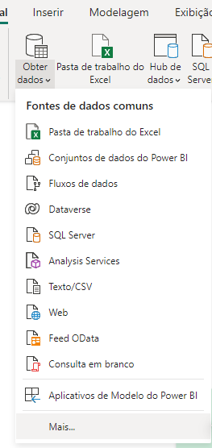
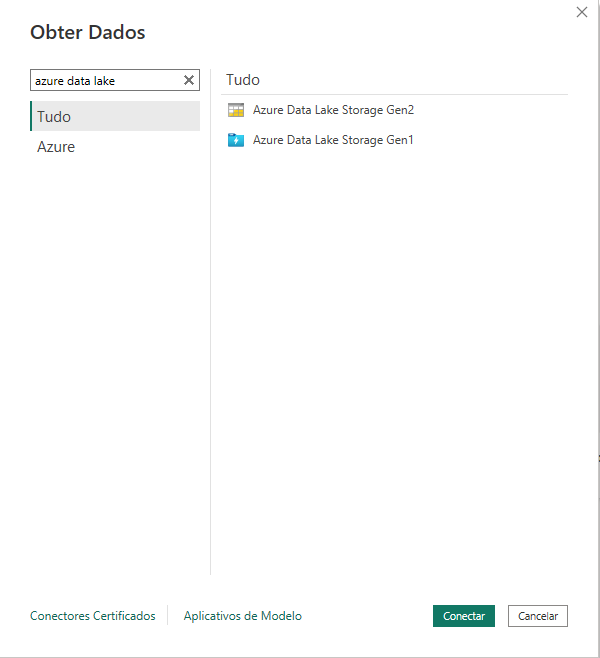
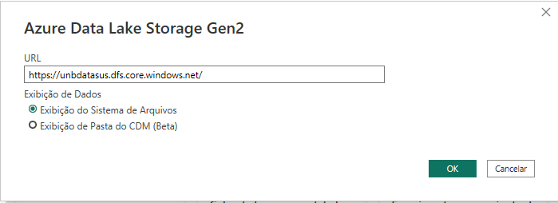
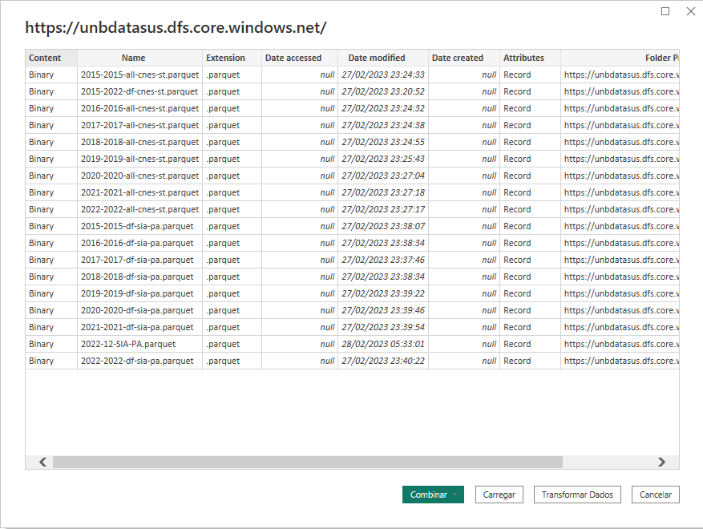
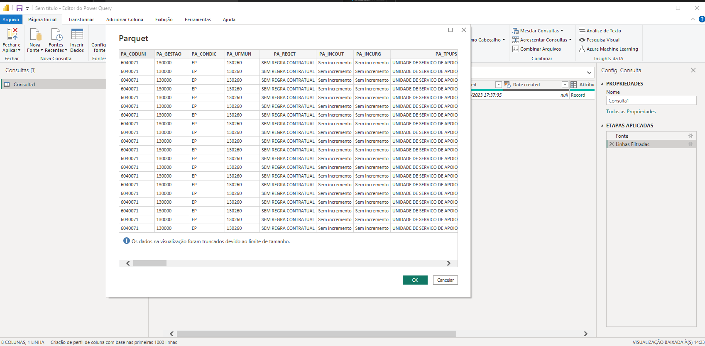

# Processo de Extração de Dados do Datasus

Este projeto tem como objetivo coletar mensalmente dados relacionados à saúde mental do Datasus, processá-los e enviá-los para um data lake para consumo posterior.

## Fluxo do processo de extração

O processo de extração envolve o uso do Github Actions com um workflow agendado ou manual e o R para baixar os dados do datasus com o pacote microdatasus e converter os dados para o formato [parquet](https://parquet.apache.org/). Os dados processados são enviados para um data lake e finalmente são consumidos por meio do Power BI para análise e relatórios.

Segue abaixo um diagrama do fluxo do


## Acessando os arquivos gerados com Power BI

Os arquivos de exemplo foram enviados para https://unbdatasus.dfs.core.windows.net/. Para acessá-los pelo Power BI, siga os passos abaixo:

1. Abra o Power BI Desktop;
2. Clique em "Obter dados" -> "Mais..." -> "Azure Data Lake Storage Gen2";
3. Cole o link https://unbdatasus.dfs.core.windows.net/ no campo "URL";
4. Selecione os arquivos desejados.











## Executando o workflow manualmente

Para executar o workflow manualmente, siga as [instruções da documentação oficial](https://docs.github.com/en/actions/managing-workflow-runs/manually-running-a-workflow)

## Executando o script localmente

Para executar o script em seu ambiente de desenvolvimento, siga os passos abaixo:

1. Configure o R em sua máquina;
2. Na raiz do projeto, execute o comando:

   1. Para SIASUS: `Rscript.exe extrair-transformar-enviar-siasus.R 2022-12 DF`;

   2. Para CNES: `Rscript.exe extrair-transformar-enviar-cnes.R 2022 all`

3. Um arquivo .parquet será gerado na raiz do projeto. Note que ele não é adicionado ao controle de versão.

## Enviando arquivos para o storage da Azure

Para enviar os arquivos para o Storage da Azure, estamos usando as seguintes Actions:

- [Azure/login](https://github.com/Azure/login)
- [Azure/cli](https://github.com/Azure/cli)

### Secrets

Para usar as Github Actions selecionadas, é necessário configurar alguns secrets no repositório. Para instruções de como configurar um secret no repositório, [siga as instruções na documentação oficial](https://docs.github.com/pt/actions/security-guides/encrypted-secrets)

#### AZURE_CREDENTIALS

JSON que representa as credenciais para serem utilizadas no login.

Para gerar esse JSON:

1. Instale o [Azure CLI](https://learn.microsoft.com/en-us/cli/azure/install-azure-cli-windows?tabs=azure-cli) e faça o login com o comando `az login`.

2. Siga as [orientações da documentação da Azure](https://learn.microsoft.com/pt-br/azure/developer/python/sdk/authentication-local-development-service-principal?tabs=azure-portal) para obter as credenciais:

   > First, use the az ad sp create-for-rbac command to create a new service principal for the app. This will also create the app registration for the app at the same time.

   > az ad sp create-for-rbac --name <nome_app_registration> --role contributor --scopes /subscriptions/<subscription_id>/resourceGroups/<resource_group_name>

   > The output of this command will look like the following. It's recommended to copy this output into a temporary file in a text editor as you'll need these values in a future step as this is the only place you ever see the client secret (password) for the service principal. You can, however, add a new password later without invalidating the service principal or existing passwords if need be.

   O `nome_app_registration` pode ser qualquer valor significativo, por exemplo "projeto_xpto_app_registration".

   O `subscription_id` pode ser obtido a partir da página principal da Azure pesquisando por `Subscriptions`

   O `resource_group_name` pode ser obtido a partir da página principal da Azure pesquisando por `Resources Groups`.

   Mais detalhes sobre o comando create-for-rbac estão na [documentação oficial](https://learn.microsoft.com/en-us/cli/azure/storage/blob?view=azure-cli-latest#az-storage-blob-upload).

3. A action de login na Azure precisa de um JSON que segue um padrão próprio. O JSON cadastrado deve seguir o seguinte formato:

   ```json
   {
     "clientId": "00000000-0000-0000-0000-000000000000",
     "subscriptionId": "734fd14d-76b2-4762-8ed9-1a832d066fb5",
     "clientSecret": "abcdefghijklmnopqrstuvwxyz",
     "tenantId": "11111111-1111-1111-1111-111111111111"
   }
   ```

   Veja que o comando para registrar a aplicação `az ad sp create-for-rbac` vai retornar em um formato diferente:

   ```json
   {
     "appId": "00000000-0000-0000-0000-000000000000",
     "displayName": "{service-principal-name}",
     "password": "abcdefghijklmnopqrstuvwxyz",
     "tenant": "11111111-1111-1111-1111-111111111111"
   }
   ```

   Ou seja, o valor de `appId` deve ir para `clientId`, o valor de `password` deve ir para `clientSecret`, o valor de `tenant` deve ir para `tenantId`, o `displayName` não é necessário e o valor do `subscritpionId` deve ser obtido via portal pesquisando por `Subscriptions`.

#### ACCOUNT_NAME

Nome da conta de storage.

Menu principal do Portal, pequise por "Storage Accounts" , crie uma, do tipo "StorageV2", caso ainda não tenha feito isso.

#### ACCOUNT_KEY

Chave da conta de storage.

Menu principal da conta de storage, "Access Keys", Escolha uma das chaves exibidas na página.

#### CONTAINER_NAME

Nome do container criado na conta de storage.

Menu principal da conta de storage, "Containers", e crie um container caso ainda não tenha criado.

## Comando de envio

Para detalhes do comando utilize veja a [documentação oficial](https://learn.microsoft.com/en-us/cli/azure/storage/blob?view=azure-cli-latest#az-storage-blob-upload). O comando em si está definido no arquivo [upload_file.sh](upload_file.sh).

## Pacote utilizado para baixar os arquivos do Datasus

SALDANHA, Raphael de Freitas; BASTOS, Ronaldo Rocha; BARCELLOS, Christovam. Microdatasus: pacote para download e pré-processamento de microdados do Departamento de Informática do SUS (DATASUS). Cad. Saúde Pública, Rio de Janeiro , v. 35, n. 9, e00032419, 2019 . Available from http://ref.scielo.org/dhcq3y.

Existe uma iniciativa semelhante em python chamda [PySUS](https://github.com/AlertaDengue/PySUS), mas que tivemos problemas para baixar especificamente o arquivo do SIA-PA.
